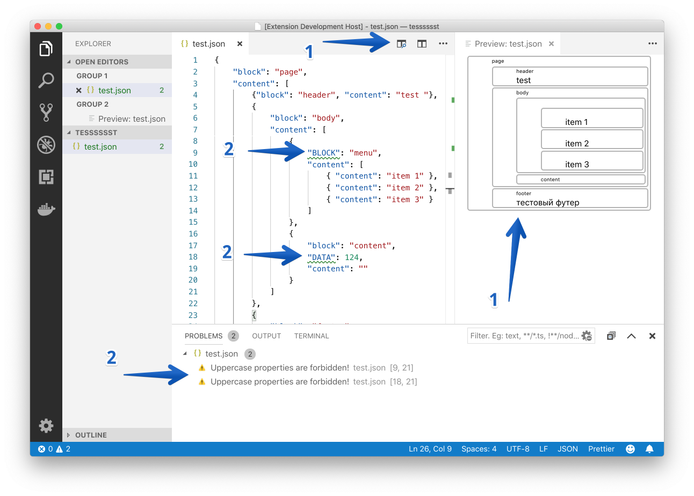
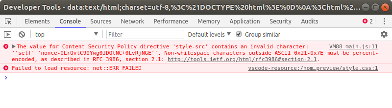
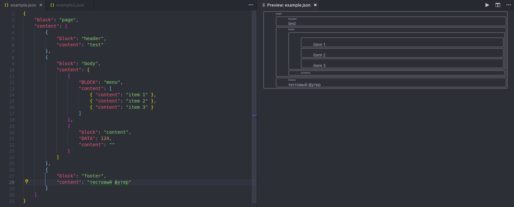
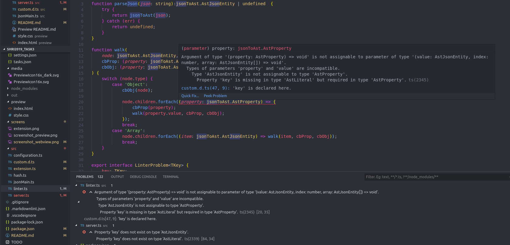
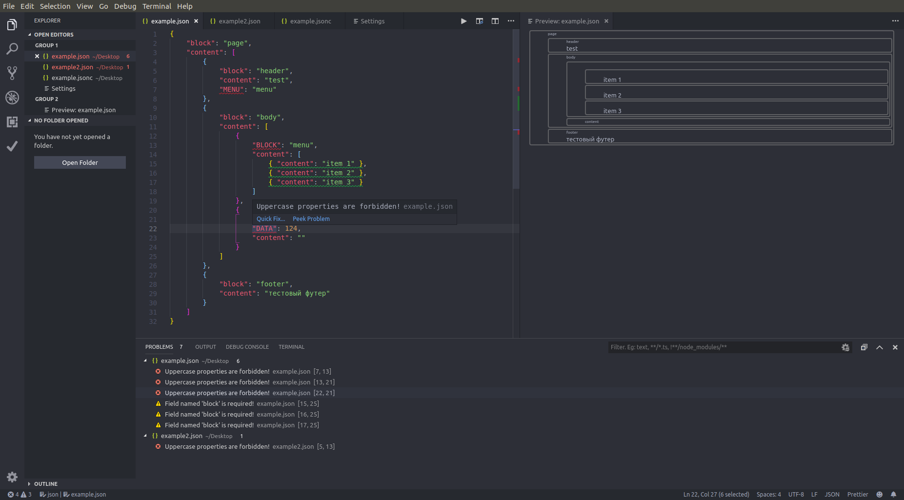

# Задание 3. Найдите ошибки

В этом репозитории находятся материалы тестового задания «Найди ошибки» для [15-й Школы разработки интерфейсов](https://yandex.ru/promo/academy/shri) (осень 2019, Москва).

Для работы приложения нужен [Node.JS](https://nodejs.org/en/) v10 или выше, а также редактор [VS Code](https://code.visualstudio.com).

## Задание

**Вам дан исходный код приложения, в котором есть ошибки. Некоторые из них стилистические, а другие даже не позволят запустить приложение. Вам нужно найти все ошибки и исправить их.**

Тестовое приложение — это плагин VS Code для удобного прототипирования интерфейсов с помощью дизайн-системы из первого задания. Вы можете описать в файле `.json` блоки, из которых состоит интерфейс. Плагин добавляет превью (1) и линтер (2) для структуры блоков.



### 1. Превью интерфейса

- Превью интерфейса доступно для всех файлов `.json`.
- Превью открывается в отдельной вкладке:
  - при выполнении команды `Example: Show preview` через палитру команд;
  - при нажатии кнопки сверху от редактора (см. скриншот);
  - при нажатии горячих клавиш **⌘⇧V** (для macOS) или **Ctrl+Shift+V** (для Windows).
- Вкладка превью должна открываться рядом с текущим редактором.
- Если превью уже открыто, то вместо открытия ещё одной вкладки пользователь должен переходить к уже открытой.
- При изменении структуры блоков в редакторе превью должно обновляться.
- Сейчас превью отображает структуру блоков в виде прямоугольников — реализуйте отображение превью с помощью вёрстки и JS из первого задания.

### 2. Линтер структуры блоков

- Линтер применяется для всех файлов `.json`.
- Линтер подсвечивает ошибочное место в файле и отображает сообщение при наведении мыши.
- Линтер отображает сообщения на панели `Problems` (**⌘⇧M** для macOS или **Ctrl+Shift+M** для Windows), сообщения группируются по файлам, при клике происходит переход к ошибочному месту.
- Сейчас плагин использует линтер-заглушку, проверяющий всего два правила: 1) «запрещены названия полей в верхнем регистре»; 2) «в каждом объекте должно быть поле `block`». Подключите в проект линтер из второго задания.

### 3. Настройки

Плагин добавляет в настройки VS Code новый раздел `Example` с параметрами:

- `example.enable` — использовать линтер;
- `example.severity.uppercaseNamesIsForbidden` — тип сообщения для правила «запрещены названия полей в верхнем регистре»;
- `example.severity.blockNameIsRequired` — тип сообщения для правила «в каждом объекте должно быть поле `block`».

Типы сообщений: `Error`, `Warning`, `Information`, `Hint`.

При изменении конфигурации новые настройки должны применяться к работе линтера.

## Как запустить

1. Открыть проект в VS Code.
2. Запустить `npm i`.
3. Нажать `F5`.

Должно открыться ещё одно окно VS Code с подключённым плагином.

## Что мы проверяем этим заданием

В этом задании мы хотим проверить вашу способность разобраться в незнакомом коде и API, а также ваш навык отладки. Пожалуйста, опишите в коде или файле README ход ваших мыслей: какие ошибки и как вы нашли, почему они возникли, какие способы их исправления существуют. Мы не ограничиваем вас в использовании сторонних инструментов и библиотек, но будем ждать от вас комментария — что и зачем вы использовали.

## Выполнение задания

### 1. Плагин запускается в рабочем режиме

#### Сообщение об ошибке при запуске расширения

```vscode-error
[undefined_publisher.shri-ext]: Menu item references a command `example.showPreviewToSide` which is not defined in the 'commands' section.
```

#### Описание решения

По сообщению ошибки понимаем, что не найдена команда `example.showPreviewToSide`. Просматривая `package.json`, замечаем, что в блоке с командами есть опечатка (v вместо w) - `example.showPrevievToSide`. После исправления расширение запускается.

> [**commit**](https://github.com/VladislavYeremeyev/SHRI2019_Task3/commit/5edcb9d2c0e05b7b665e06d7c56196e642e54fc2) с исправлениями

### 2. Работает перечисленный в условии функционал

### 2.1 Превью интерфейса

Возможность открыть превью присутствует у всех файлов с расширением `.json`. Также превью открывается всеми тремя перечисленными в условии способами.

#### Вкладка превью должна открываться рядом с текущим редактором

Изначально превью открывается в отдельной колонке окна редактора (как на скриншоте с описанием задания). Требование, что вкладка превью должна открываться рядом с текущим редактором, я понял так, что при запуске команды открытия превью, оно открывается в соседней вкладке в той же колонке окна редактора.

#### Описание решения

В файле `extension.ts` присутствует следующий код:

```ts
const initPreviewPanel = (document: vscode.TextDocument) => {
  const fileName = basename(document.fileName);

  const panel = vscode.window.createWebviewPanel(
    "example.preview",
    `Preview: ${fileName}`,
    vscode.ViewColumn.Beside,
    {
      enableScripts: true
    }
  );

  PANELS[document.uri.path] = panel;

  const e = panel.onDidDispose(() => {
    delete PANELS[document.uri.path];
    e.dispose();
  });

  return panel;
};
```

В методе `createWebviewPanel` третьим параметром передаются опции показа (`showOptions`), такие как фокусировка на новом webview, а также локация webview в окне редактора. Изначально указан параметр `vscode.ViewColumn.Beside`, который открывает webview в соседней с активной вкладкой колонке. При изменении значения на `vscode.ViewColumn.Active`, webview будет открываться рядом в той же колонке окна редактора, что и активная вкладка.

**UPD (24.06.19):**

Всё-таки решил оставить `vscode.ViewColumn.Beside`, так как с точки зрения UX это является более удобным, когда изменяя файл, сразу видишь измененное Preview и нет необходимости переключаться между вкладками.

> [**commit**](https://github.com/VladislavYeremeyev/SHRI2019_Task3/commit/a168fc7eca8c8e58fee5f642042c179d67f5e1b9) с исправлениями

---

#### Если превью уже открыто, то вместо открытия ещё одной вкладки пользователь должен переходить к уже открытой

#### Описание решения

В файле `extension.ts` присутствует следующий код:

```ts
const openPreview = (context: vscode.ExtensionContext) => {
  const editor = vscode.window.activeTextEditor;

  if (editor !== undefined) {
    const document: vscode.TextDocument = editor.document;

    const path = document.uri.toString();
    const panel = PANELS[path];

    if (panel) {
      panel.reveal();
    } else {
      const panel = initPreviewPanel(document);
      setPreviewContent(document, context);
      context.subscriptions.push(panel);
    }
  }
};
```

В конце кода присутствует условие на проверку открыта ли уже вкладка с превью, но при этом превью все равно открывается каждый раз в новой вкладке. При дебаге замечаем, что `document.uri.toString()` возвращает строку вида `"file:///{path}/{fileName}.json"`, то есть в этой строке присутсвует URI `scheme` параметр, в данном случае со значением `file`.

При этом в этом же файле `extension.ts` в `initPreviewPanel` при запуске команды открытия preview создается панель с webview и в объект `PANELS` записывается переменная панели по ключу `document.uri.path`, который имеет вид `"/{path}/{fileName}.json"`:

```ts
const initPreviewPanel = (document: vscode.TextDocument) => {
  const fileName = basename(document.fileName);

  const panel = vscode.window.createWebviewPanel(
    "example.preview",
    `Preview: ${fileName}`,
    vscode.ViewColumn.Active,
    {
      enableScripts: true
    }
  );

  PANELS[document.uri.path] = panel;

  const e = panel.onDidDispose(() => {
    delete PANELS[document.uri.path];
    e.dispose();
  });

  return panel;
};
```

Именно поэтому в условии никогда не находится существующая вкладка, так как происходит поиск по неверному ключу.

Если исправить `const path = document.uri.toString();` на `const path = document.uri.path;` или `const path = document.uri.fsPath;` (**.fsPath** отличается от **.path** тем, что использует специфичные для платформ разделители в путях, а также обработку **UNC** (Universal Naming Convention) путей), то плагин будет работать корректно.

> [**commit**](https://github.com/VladislavYeremeyev/SHRI2019_Task3/commit/a168fc7eca8c8e58fee5f642042c179d67f5e1b9) с исправлениями

---

#### При изменении структуры блоков в редакторе превью должно обновляться

При запуске превью отображается некорректно.

#### Описание решения

Убрал лишний отступ в `div` в файле `preview/style.css`.

Запускаем расширение, открываем превью и используем команду **Developer: Open Webview Developer Tools** для дебага webview.
Dev Tools показывает следующие ошибки:



По ошибкам замечаю, что в `preview/index.html` в атрибуте `nonce` вместо английского символа `c`, написана русская буква `c`. Также, как описано в [документации](https://code.visualstudio.com/api/extension-guides/webview#loading-local-content) webview, webview запускаются в изолированном контексте и в целях безопасности не могут напрямую получать доступ к локальным ресурсам. Поэтому нужно использовать схему `vscode-resource:` внутри webview. Поэтому в директиве `style-src` добавил `vscode-resource:`.

Еще добавил пропущенный `/` в строке `<base href="{{mediaPath}}/">`

В файле `preview/style.css` убрал фиксированную ширину (`width: 100px`) у `div`, чтобы preview корректно отображалось.

Результат:



> [**commit**](https://github.com/VladislavYeremeyev/SHRI2019_Task3/commit/a51c0109c867fa613c2c0ff8d9c1ef9c90367616) с исправлениями

### 2.2 Линтер структуры блоков

Изначально линтер не работает, как ожидалось. Также в файлах `src/linter.ts` и `src/server.ts` можно наблюдать ошибки, связанные с типами.



#### Описание решения

Просмотрев ошибки, замечаем, что ошибка в описании типов в файле `src/custom.d.ts` в интерфейсе объекта `AstObject`. Логично, что "детьми" объекта должны являться его поля (`AstProperty`), которые состоят из пар ключ-значение (`AstIdentifier` и `AstJsonEntity`). Также, это подтверждается в репозитории [библиотеки](https://github.com/vtrushin/json-to-ast#node-types). Но в коде значение типа `children` у объекта - массив сущностей `AstJsonEntity[]`, а не массив полей объекта `AstProperty[]`.

```ts
export interface AstObject {
  type: "Object";
  children: AstJsonEntity[];
  loc: AstLocation;
}

export interface AstProperty {
  type: "Property";
  key: AstIdentifier;
  value: AstJsonEntity;
  loc: AstLocation;
}

export interface AstIdentifier {
  type: "Identifier";
  value: string;
  raw: string;
  loc: AstLocation;
}

export type AstJsonEntity = AstObject | AstArray | AstLiteral;
```

После исправления ошибки пропадают:

```ts
export interface AstObject {
  type: "Object";
  children: AstProperty[];
  loc: AstLocation;
}
```

Но отображение ошибок линтером так и не появляется. Чтобы найти проблему, добавляю возможность дебажить `Language Server` расширения, описывая конфигурации в файле `.vscode/launch.json`. Это позволяет запустить дебаг-режим для клиента и сервера поочередно либо одновременно (с помощью `compounds`):

```json
{
  "version": "0.2.0",
  "configurations": [
    {
      "name": "Run Extension",
      "type": "extensionHost",
      "request": "launch",
      "runtimeExecutable": "${execPath}",
      "args": ["--extensionDevelopmentPath=${workspaceFolder}"],
      "outFiles": ["${workspaceFolder}/out/**/*.js"],
      "preLaunchTask": "npm: watch"
    },
    {
      "type": "node",
      "request": "attach",
      "name": "Attach to Server",
      "port": 6009,
      "restart": true,
      "outFiles": ["${workspaceFolder}/out/**/*.js"]
    },
    {
      "name": "Extension Tests",
      "type": "extensionHost",
      "request": "launch",
      "runtimeExecutable": "${execPath}",
      "args": [
        "--extensionDevelopmentPath=${workspaceFolder}",
        "--extensionTestsPath=${workspaceFolder}/out/test"
      ],
      "outFiles": ["${workspaceFolder}/out/test/**/*.js"],
      "preLaunchTask": "npm: watch"
    }
  ],
  "compounds": [
    {
      "name": "Client + Server",
      "configurations": ["Run Extension", "Attach to Server"]
    }
  ]
}
```

При дебаге замечаем, что ошибки распознаются корректно, но функция `makeLint` в файле `src/linter.ts` всегда возвращает пустой массив ошибок `errors`.

```ts
export function makeLint<TProblemKey>(
  json: string,
  validateProperty: (
    property: jsonToAst.AstProperty
  ) => LinterProblem<TProblemKey>[],
  validateObject: (
    property: jsonToAst.AstObject
  ) => LinterProblem<TProblemKey>[]
): LinterProblem<TProblemKey>[] {
  const errors: LinterProblem<TProblemKey>[] = [];
  const ast: jsonToAst.AstJsonEntity | undefined = parseJson(json);

  const cbProp = (property: jsonToAst.AstProperty) => {
    errors.concat(...validateProperty(property));
  };

  const cbObj = (obj: jsonToAst.AstObject) => {
    errors.concat(...validateObject(obj));
  };

  if (ast) {
    walk(ast, cbProp, cbObj);
  }

  return errors;
}
```

Изначально создается пустой массив `errors`. Но `Array.prototype.concat()` не изменяет исходный массив. Поэтому `errors` всегда будет иметь изначальное значение - пустой массив. Данную проблему можно исправить, используя вместо `.concat()` метод `.push()` или сделать `errors` не `const`, а `let` переменной и добавить присвоение:

```ts
errors = errors.concat(...validateObject(obj));
```

Либо использовать **ES6** деструктуризацию (Spread & Rest Syntax):

```ts
errors = [...errors, ...validateObject(obj)];
```

После исправлений линтер начинает подсвечивать ошибки:



Также добавил `toLowerCase()` в проверку наличия поля `block` в объекте, чтобы линтер не выдавал ошибку `"в каждом объекте должно быть поле block"`, если есть поле `block` с буквами в другом регистре (например, `BLOCK`, `blOck` и т. д.), так как на скриншоте с примером работы расширения была изображена именно такая логика.

Файл `src/server.ts`:

```ts
const validateObject = (obj: jsonToAst.AstObject): LinterProblem<RuleKeys>[] =>
  obj.children.some(p => p.key.value.toLowerCase() === "block")
    ? []
    : [{ key: RuleKeys.BlockNameIsRequired, loc: obj.loc }];
```

> [**commit**](https://github.com/VladislavYeremeyev/SHRI2019_Task3/commit/132d82137fb65e7e53b0e874bc4250647cd74fa5) с исправлениями

**UPD (01.07.19):**

Решил убрать `toLowerCase()`, так как поля вроде `bLocK` (с символами в верхнем регистре) при работе линтера считались валидными, хотя являются ошибочными и не рендерятся в превью. К тому же ошибка описывает `Uppercase Names Is Forbidden` - именно имена в верхнем регистре, а не наличие символов в верхнем регистре, поэтому более правильно всё-таки показывать ошибку, что `block` не найден. С другой стороны можно было бы изменить логику ошибки: поменять регулярное выражение на `/[A-Z]+/` (как минимум одна буква в верхнем регистре) и выдавать ошибку о том, что присутствуют символы в верхнем регистре.

### 2.3 Настройки

Настройки работают корректно. Установил значение `example.enable` в `true` по умолчанию, чтобы линтер работал сразу при запуске. Изначально не работало включение\выключение линтера (изменение настройки плагина `example.enable`). Добавил в `validateTextDocument` в файле `src/server.ts` проверку значения поля `enable` у настроек, чтобы была возможность включать\выключать линтер.

> [**commit**](https://github.com/VladislavYeremeyev/SHRI2019_Task3/commit/132d82137fb65e7e53b0e874bc4250647cd74fa5) с исправлениями

### 3. Единый codestyle

- Расширил правила TSLint, пробежался по всем файлам линтером и Prettier'ом. Поменял названия переменных с рекомендациями TSLint.

### 4. Отсутствие лишнего кода и ошибок

- Убрал лишние импорты. Так же убрал лишние файлы `src/jsonMain.ts` и `src/hash.ts`, которые нигде не использовались.

### 5. Дополнительно

- Расширил TSLint-правила конфигом Airbnb, подключил Prettier и отформатировал файлы.
- Добавил NPM-скрипты для увеличения скорости разработки:
  - `npm run prettier` - форматирует все `.ts` файлы из папки `src` с помощью `Prettier`.
  - `npm run lint` - форматирует все `.ts` файлы из папки `src` с помощью `TSLint` (Правила, к которым может быть применен autofix).
- Добавил поддержку формата `JSON with comments` (`.jsonc`) (Интеграция работы линтера и комментариев в файле пока не реализована).
- Добавил линтер из второго задания и стили из первого задания. Исходный код находится в отдельной ветке, чтобы была возможность оценить исходное расширение.

> [**commit**](https://github.com/VladislavYeremeyev/SHRI2019_Task3/commit/c08d1e28544d1df8d2f1d4aacc962afbe6cf25ba) с линтером

Для просмотра:

- скачать этот [репозиторий](https://github.com/VladislavYeremeyev/SHRI2019_Task3)

- поменять ветску с `master` на [custom-linter](https://github.com/VladislavYeremeyev/SHRI2019_Task3/tree/custom-linter):

```git
git checkout custom-linter
```

- убедиться, что выбрана нужная ветка (В папке `src` будет больше файлов)
- установить зависимости:

```git
npm install
```

- запустить расширение vscode (`F5` или вкладка `Debug (Ctrl + Shift + D)` и `Run`)
